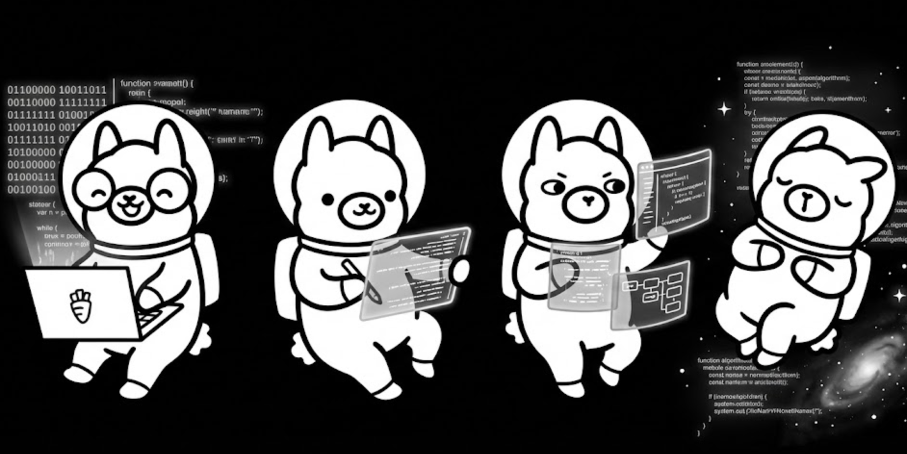

# LOCAL.AGENT

Private agentic CLI for your self-hosted AI. Runs on Ollama, stays on your machine.

## Setup

```bash
git clone https://github.com/shostkevych/ollama-ripper.git
cd ollama-ripper
bun install
bun start
```

First launch walks you through connecting to Ollama and picking a model.

## Features

- AI agent with tool use (web search, file access, shell)
- Streaming responses from local models via Ollama
- VRAM-aware context management
- Cloud ultrathink mode (route hard questions to OpenAI when local isn't enough)
- Obsidian integration via MCP
- Beautiful terminal UI built with React Ink

## Q&A

**Was this vibecoded?** Yes, pretty much, but I've spent some time on this.

**Why vibecoded?** Because why not.

**What does this solve?** It gives you a nice CLI to talk to your self-hosted AI.

**Why that simple?** Because everything you need is a smart basic AI agent, web search, and shell.

**I need more?** Do additional vibecoding and if that looks good, raise a PR.

**Any new features coming?** Yes, please check updates in the repo.

## My Setup

RTX 5070 Ti running `gpt-oss:20b`. That worked perfectly. If it's not enough, there is the cloud ultrathink feature (that was a nice idea in Claude Code CLI tools, thanks).

## Upcoming

- Vision model support
- Additional tools

## License

MIT
